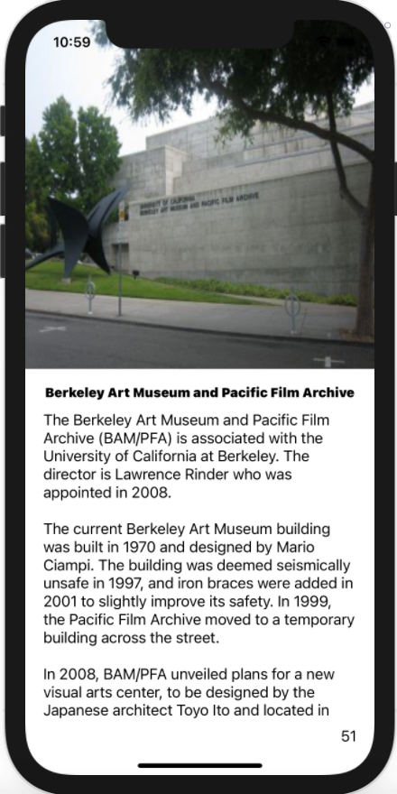

# CalTours
A campus tour iOS mobile application that gives users information about various points of interest around the Cal campus.

Sample Images:
<table>
    <tr>
        <td></td>
        <td></td>
    </tr>
    <tr>
        <td></td>
        <td></td>
    </tr>
</table>

This app was developed in Swift while storing and encoding the points of interest in JSON. I utilized PageViewController to display the various points of interest while following the model-view-controller design pattern.